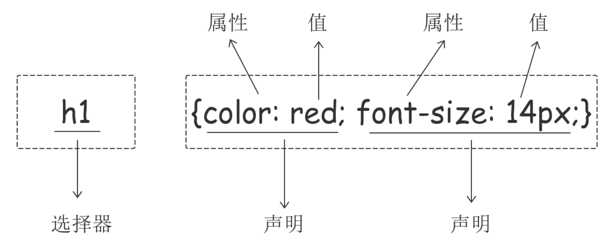

[TOC]

## css简介及其语法
>`css介绍：`
>css定义如何显示html元素，当浏览器 读到一个样式表，就会按照这个样式表来对文档进行渲染。
>`css语法：`


##css的几种引用方式
###行内引用
>行内式是在标记的style属性中设置css样式
>`<div id="d1" style="color: red">Hello world.</div>`
###内部样式
>嵌入式是将css样式几种写在网页的<head></head>标签对的<style></style>标签对中
```
<head>
    <meta charset="UTF-8">
    <title>Title</title>
    <style>
        p{
            background-color: #2b99ff;
        }
    </style>
</head>
```
###外部样式
>外部样式就是将css卸载一个单独的文件中，然后在页面进行引入调用，
>`<link href="mystyle.css" rel="stylesheet" type="text/css"/>`

##CSS选择器
###基本选择器
```
<!DOCTYPE html>
<html lang="en">
<head>
    <meta charset="UTF-8">
    <title>css选择器实例</title>
    <style>
        /*元素选择器*/
        p{color: red;}

        /*标签选择器*/
        div{color: blue;font-size: 24px}

        /*ID选择器*/
        #d2 {color: yellow;}

        /*类选择器*/
        /*注意：*/
        /*样式类名不要用数字开头（有的浏览器不认）。*/
        /*标签中的class属性如果有多个，要用空格分隔。*/
        .c1 {color:blue;}

        /**通用选择器*/
        * {color:deeppink;}
    </style>
    <!--一般把css样式标签都写到.css文件中，在这里调用-->
    <!--<link rel="stylesheet" href="css.css">-->
</head>
<body>
<div>div标签</div>
<div id="d2"> div标签2</div>
<p class="c1">p标签</p>
<span class="c1">我是span标签</span>
<span>我是span2号</span>
</body>
</html>
```
###组合选择器
```
<!DOCTYPE html>
<html lang="en">
<head>
    <meta charset="UTF-8">
        <meta http-equiv="X-UA-Compatible" content="IE=edge">
    <meta name="viewport" content="width=device-width, initial-scale=1">
    <title>组合选择器实例</title>
    <style>
        /*后代选择器，div下面的全部a标签*/
        div a {
            color: red;
        }

        /*儿子选择器，div下面第一级别的a标签*/
        div>a {
            color:green;
        }

        /*毗邻选择器，把样式给a后面的span标签*/
        a+span{
            color: blue;
        }

        /*弟弟选择器，a后面的全部span标签*/
        a~span{
            color:chocolate;
        }

        /*类下面的全部a标签*/
        .c1 a {
            color: brown;
        }
    </style>
</head>
<body>
<div id="d1" class="c1">
    <p><a>我是孙子a标签</a></p>
    <span>我是a前面的span标签</span>
    <a>我是儿子a标签</a>
    <span>我是span标签1号</span>
    <span>我是span标签2号</span>
    <span>我是span标签2号</span>
    <p>我是span标签2号</p>
</div>
</body>
</html>
```
###属性选择器
```
<!DOCTYPE html>
<html lang="en">
<head>
    <meta charset="UTF-8">
    <meta http-equiv="X-UA-Compatible" content="IE=edge">
    <meta name="viewport" content="width=device-width, initial-scale=1">
    <title>属性选择器</title>
    <style>
        /*用于选取带有s20属性的元素。*/
        [s20] {
            color: red;
        }
        /*用于选取带有s20属性和值为hao的元素。*/
        [s20="hao"] {
            color: green;
        }

        /*找到所有title属性以hello开头的元素*/
        [title^="hello"] {
          color: red;
        }

        /*找到所有title属性以hello结尾的元素*/
        [title$="hello"] {
          color: yellow;
        }

        /*找到所有title属性中包含（字符串包含）hello的元素*/
        [title*="hello"] {
          color: red;
        }

        /*找到所有title属性(有多个值或值以空格分割)中有一个值为hello的元素：*/
        [title~="hello"] {
          color: green;
        }
        
        /*id为d3的标签，和p标签*/
        #d3,p {
            color: deeppink;
        }
        
        /*选择全部p标签*/
        p {
            color:greenyellow;
        }
    </style>
</head>
<body>
<div s20>111</div>
<div s20="hao">222</div>
<div id="d3">333</div>
<p>第1个p标签</p>
<p>第2个p标签</p>
</body>
</html>
```
###伪类和伪元素选择器
`before和after多用于清除浮动。`
```
<!DOCTYPE html>
<html lang="en">
<head>
    <meta charset="UTF-8">
    <meta http-equiv="X-UA-Compatible" content="IE=edge">
    <meta name="viewport" content="width=device-width, initial-scale=1">
    <title>伪类和伪元素选择器</title>
    <style>
        /*!*给未访问的连接添加颜色*!*/
        a:link {
            color:green;
        }

        /*已访问的连接，点击以后变颜色*/
        a:visited {
            color:red;
        }

        /* 选定的链接 */
        a:active {
          color: #0000FF
        }

        /*!*鼠标放到字体上字体变颜色*!*/
        #d1:hover {
            color:chocolate;
        }

        /*input输入框获取焦点时样式*/
        input:focus {
            outline:none;
            background-color: greenyellow;
        }

        /*在每个<p>元素之前插入内容*/
        p:before {
            content: "*";  /*使用css添加的内容*/
            color: red;        /*改内容杨勇的样式*/
        }
        /*在每个<p>元素之后插入内容*/
        p:after {
            content: "[?]";
            color: blue;
        }
    </style>
</head>
<body>
<a href="http://www.sogo.com">sogo</a>
<a href="http://www.sogoba.com">sogoba</a>
<div id="d1">div</div>
<input type="text">
<p>海燕，在苍茫的大海上，狂风卷积着乌云，在乌云和大海之间</p>
<p>海燕，在苍茫的大海上，狂风卷积着乌云，在乌云和大海之间</p>
<p>海燕，在苍茫的大海上，狂风卷积着乌云，在乌云和大海之间</p>
<p>高傲的飞翔。。。</p>
</body>
</html>
```
###CSS选择器的优先级
#####`权重越高优先级越低`


##CSS属性相关
###字体和文本相关属性
| 字体属性          |                      属性参数                      | 意义                                       |
| ----------------- | :------------------------------------------------: | ------------------------------------------ |
| `font-family`     | "Microsoft Yahei", "微软雅黑", "Arial", sans-serif | 可以把多个字体名称作为一个“回退”系统来保存 |
| `font-size`       |                      inherit                       | 表示继承父元素的字体大小值。               |
|                   |                                                    | 14px                                       |
| `font-weight`     |                                                    | 字体粗细                                   |
|                   |                                                    | normal                                     |
|                   |                                                    | bold                                       |
|                   |                                                    | bolder                                     |
|                   |                                                    | lighter                                    |
|                   |                                                    | 100~900                                    |
|                   |                                                    | inherit                                    |
| `text-align`      |                                                    | 文字对齐                                   |
|                   |                                                    | left                                       |
|                   |                                                    | right                                      |
|                   |                                                    | center                                     |
|                   |                                                    | justify                                    |
| `text-decoration` |                                                    | 文字装饰，属性用来给文字添加特殊效果。     |
|                   |                                                    | none                                       |
|                   |                                                    | underline                                  |
|                   |                                                    | overline                                   |
|                   |                                                    | line-through                               |
|                   |                                                    | inherit                                    |
| `text-indent`     |                                                    | 首行缩进                                   |
```
<!DOCTYPE html>
<html lang="en">
<head>
    <meta charset="UTF-8">
    <meta http-equiv="X-UA-Compatible" content="IE=edge">
    <meta name="viewport" content="width=device-width,initial-scale=1">
    <title>字体和文本相关属性</title>
    <style>
        /*font-family 可以把多个字体名称作为一个回退系统来保存，如果浏览器不支持第一个字体，则会尝试下一个。浏览器会使用它可识别的第一个值*/
        p{
            font-size: 30px; /*字体大小*/
            /*font-weight: 900; !*字体粗细*!*/
            font-family: "Arial", "Microsoft YaHei", "微软雅黑",sans serif; /*字体样式*/
            color: red;
            color: #ffc5b0;  /*十六进制*/
            color: rgb(0,255,0); /*RGB值*/
            color: rgba(0,255,0,0.3);  /*第四个值为alpha, 指定了色彩的透明度/不透明度，它的范围为0.0到1.0之间。*/
        }

        #p1 {
            /*w文本的居中方式*/
            text-align: justify;
            /*给文本加上下划线*/
            text-decoration: underline;
            text-indent: 28px
        }

        /*去掉a标签默认的下划线*/
        a {
            text-decoration: none;
        }
    </style>
</head>
<body>
    <p style="font-weight: 100">在苍茫的大海上，狂风卷积着乌云。</p>
    <p>在苍茫的大海上，狂风卷积着乌云。</p>
    <p style="font-weight: 900">在苍茫的大海上，狂风卷积着乌云。</p>
    <p id="p1">在苍茫的大海上，狂风卷积着乌云。海上，狂风卷积着乌云。
    海上，狂风卷积着乌云。海上，狂风卷积着乌云。
        海上，狂风卷积着乌云。
        海上，狂风卷积着乌云。狂风卷积着乌云。狂风卷积着乌云。狂风卷积着乌云。狂风卷积着乌云。狂风卷积着乌云。狂风卷积着乌云。狂风卷积着乌云。狂风卷积着乌云。狂风卷积着乌云。狂风卷积着乌云
    </p>
    <a href="http://www.sogo.com">sogo</a>
</body>
</html>
```
###背景属性
```
<!DOCTYPE html>
<html lang="en">
<head>
    <meta charset="UTF-8">
    <meta http-equiv="X-UA-Compatible" content="IE=edge">
    <meta name="viewport" content="width=device-width,initial-scale=1">
    <title>背景相关属性</title>
    <style>
        div {
            height: 600px;
            width: 300px;
            /*背景颜色*/
            background-color: red;
            background: url('./meitu.jpg') no-repeat 200px 200px;
            /*背景图片*/
            /*background-image: url('1.jpg');*/
            /*背景重复*/
             /*repeat(默认):背景图片平铺排满整个网页*/
             /*repeat-x：背景图片只在水平方向上平铺*/
             /*repeat-y：背景图片只在垂直方向上平铺*/
             /*no-repeat：背景图片不平铺*/
            /**!*/
            /*background-repeat: no-repeat; */
            /*!*背景位置*!*/
            /*background-position: right top（20px 20px）;*/
        }
        .c1 {
            height:500px;
            width: 100%;
            background-color:red;
        }
        /*滚动背景图示例*/
        .c2 {
            height:500px;
            width:100%;
            background: url("https://ss3.bdstatic.com/70cFv8Sh_Q1YnxGkpoWK1HF6hhy/it/u=5510439,2567615604&fm=27&gp=0.jpg" ) no-repeat fixed center center;
        }
        .c3 {
            height: 500px;
            width: 100%;
            background-color: blue;
        }
    </style>
</head>
<body>
<div class="c1"></div>
<div class="c2"></div>
<div class="c3"></div>
</body>
</html>
```
###边框
`border-radius   用这个属性能实现圆角边框的效果。`

```
<!DOCTYPE html>
<html lang="en">
<head>
    <meta charset="UTF-8">
    <meta http-equiv="X-UA-Compatible" content="IE=edge">
    <meta name="viewport" content="width=device-width,initial-scale=1">
    <title>边框相关属性</title>
    <style>
        div {
            width:200px;
            height: 200px;
            background-color: red;
            border-radius:100px; /*实现圆角边框的效果*/
        }
    </style>
</head>
<body>
<div></div>
</body>
</html>
```
###display属性
```
<!DOCTYPE html>
<html lang="zh-cn">
<head>
    <meta charset="UTF-8">
    <meta http-equiv="X-UA-Compatible" content="IE=edge">
    <meta name="viewport" content="width=device-width, initial-scale=1">
    <title>display属性</title>
    <style>
        div {
            background-color:red;
            width: 1000px;
            display: inline;
        }
        a {
            /*display: block;*/
            /*display: none;*/
            visibility: hidden;
            width: 1000px;
        }
    </style>
</head>
<body>

<div>div</div>
<a href="">a1</a>
<a href="">a2</a>
<div>div2</div>
</body>
</html>
```
###CSS盒子模型
<ul type="none">
<li>margin：用于控制元素与元素之间的距离；margin的最基本用途就是控制元素周围空间的间隔，从视觉角度上达到相互隔开的目的。</li>
<li>padding：用于控制内容与边框之间的距离</li>
<li>Border(边框)：围绕在内边距和内容外的边距</li>
<li>Content(内容)：盒子的内容，显示文本和图像。</li>
</ul>

```
<!DOCTYPE html>
<html lang="zh-cn">
<head>
    <meta charset="UTF-8">
    <meta http-equiv="X-UA-Compatible" content="IE=edge">
    <meta name="viewport" content="width=device-width, initial-scale=1">
    <title>CSS盒子模型</title>
    <style>
        .c1 {
            height: 200px;
            width: 200px;
            background-color: red;
            border: 5px solid green;
            /*padding-top: 5px;*/
            /*padding-right: 10px;*/
            /*padding-bottom: 15px;*/
            /*padding-left: 20px;*/

            /*同时设置多个值 推荐使用简写*/
            /*padding: 5px 10px 15px 20px; !*上 右  下 左*!*/
            /*padding: 5px 10px 20px;  !* 上 左右 下*!*/
            /*padding: 10px 20px; !*上下 左右*!*/
            padding: 20px;  /*上下左右*/

            /*padding: 20px;*/
            /*margin-top: 100px;*/
            margin: 5px 10px 15px 20px;
        }
        button {
            padding: 20px;
        }
    </style>
</head>
<body>
<div class="c1"></div>
<div class="c1"></div>
<button>按钮</button>
</body>
</html>
```
###float
```
<!DOCTYPE html>
<html lang="zh-cn">
<head>
    <meta charset="UTF-8">
    <meta http-equiv="X-UA-Compatible" content="IE=edge">
    <meta name="viewport" content="width=device-width, initial-scale=1">
    <title>float示例</title>
    <style>
        * {
            margin: 0;
        }
        .nav {
            background-color: black;
            /*height: 50px;*/
        }
        ul {
            list-style-type: none;
            padding: 0;
        }
        ul.nav-left>li {
            float: left;
            /*width: 100px;*/
            padding: 15px;
        }
        ul.nav-right>li {
            float: right;
            /*width: 100px;*/
            padding: 15px;
        }
        ul a {
            color: #eee;
            text-decoration: none;
        }
        ul a:hover {
            color: red;
        }
        /*清除浮动的副作用*/
        .clearfix:after {
            content: "";
            display: block;
            clear: left; /*我这个标签 左边不能有浮动的元素*/
        }

        .container {
            width: 1028px;
            margin: 0 auto;
        }
    </style>
</head>
<body>

<!--顶部导航栏 开始-->
<div class="nav clearfix">
    <div class="container clearfix">
        <ul class="nav-left">
            <li><a href="">玉米商城</a></li>
            <li><a href="">大米</a></li>
            <li><a href="">小米</a></li>
            <li><a href="">黑米</a></li>
            <li><a href="">红米</a></li>
        </ul>
        <!--<div class="c2"></div>-->

        <ul class="nav-right">
            <li><a href="">购物车</a></li>
            <li><a href="">登录</a></li>
            <li><a href="">注册</a></li>
        </ul>
    </div>
</div>
<!--顶部导航栏 结束-->
<div></div>
</body>
</html>
```
###overflow溢出属性
```
<!DOCTYPE html>
<html lang="zh-cn">
<head>
    <meta charset="UTF-8">
    <meta http-equiv="X-UA-Compatible" content="IE=edge">
    <meta name="viewport" content="width=device-width, initial-scale=1">
    <title>overflow属性</title>
    <style>
        .c1 {
            width: 100px;
            height: 200px;
            border: 1px solid black;
            /*overflow: auto;*/
            overflow-y: scroll;
        }
        .head-img {
            width: 128px;
            height: 128px;
            border-radius: 64px;
            border: 3px solid yellow;
            overflow: hidden;
        }
        .head-img img {
            max-width: 100%;
        }
    </style>
</head>
<body>

<div class="c1">
    海燕啊，你可长点心吧！海燕啊，你可长点心吧！海燕啊，你可长点心吧！海燕啊，你可长点心吧！海燕啊，你可长点心吧！海燕啊，你可长点心吧！海燕啊，你可长点心吧！
</div>


<div class="head-img">
    
</div>
</body>
</html>
```
###定位
```
<!DOCTYPE html>
<html lang="zh-cn">
<head>
    <meta charset="UTF-8">
    <meta http-equiv="X-UA-Compatible" content="IE=edge">
    <meta name="viewport" content="width=device-width, initial-scale=1">
    <title>定位属性</title>

    <style>
        * {
            margin: 0;
            padding: 0;
        }
        .c1,
        .c2,
        .c3,
        .cc{
            height: 100px;
            width: 100px;
        }
        .c1 {
            background-color: red;
        }
        .c2 {
            background-color: blue;
            /*position: relative; !*相对定位*!*/
            position: absolute;
            left: 100px;
            top: 100px;
        }
        .c3 {
            background-color: green;
        }
        .cc {
            position: relative;  /*光写一个relative 不会改变位置 但是它变成了已经定位的标签*/
            background-color: deeppink;
        }

        .sc {
            position: fixed;
            right: 20px;
            bottom: 20px;
        }
    </style>
</head>
<body>

<div class="c1"></div>
<div class="cc">
    <div class="c2"></div>
</div>

<div class="c3"></div>


<button class="sc">返回顶部</button>

</body>
</html>
```