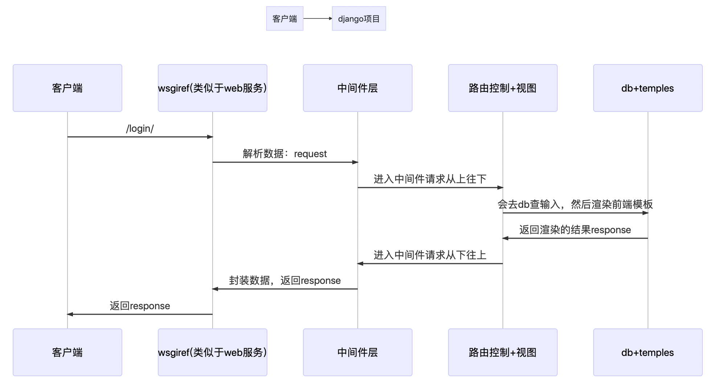

[TOC]
# 创建一个新的项目

`django-admin.py startproject my_project`

# 创建一个新的app

` python3 manage.py startapp my_app `

# 启动Django中的开发服务器

```shell
# make new migrations
python3 manage.py makemigrations
# apply all migrations
python3 manage.py migrate
# run server
python3 manage.py runserver
```
# 创建一个models

```python
class App1(models.Model):
    title = models.CharField(max_length=100)
    category = models.CharField(max_length=50, blank=True)
    date_time = models.DateTimeField(auto_now_add=True)

    def __unicode__(self):
        return self.title

    class Meta:
        ordering = ['-date_time']
```
# 创建一个超级用户

```shell
python3 manage.py createsuperuser
# 输入http://127.0.0.1:8000/admin登录后台
```
# 进入django中的交互式shell

```
python3 manage.py shell
from app1.models import App1
# create(增加操作)
App1.objects.create(title='title',category='category1')
# all和get(查看操作)
App1.objects.all()
App1.objects.get(id=1)
# update(修改操作)
demo = App1.objects.get(id=1)
demo.title
demo.title='title2'
# delete(删除操作)
demo.delete()
```
# django的请求流程



# requirements.txt批量安装包

`pip install -r requirements.txt`