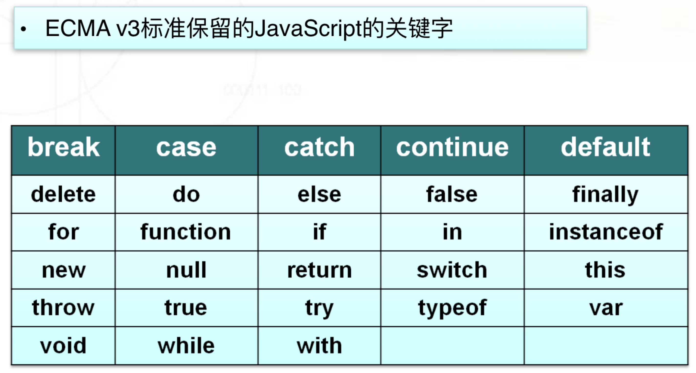
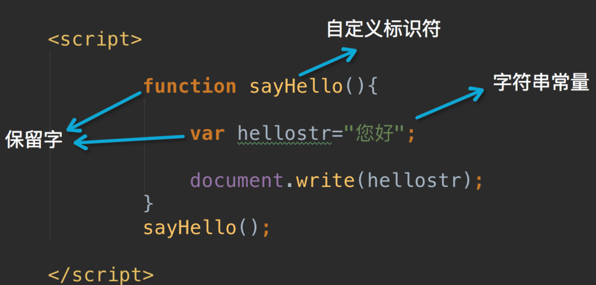
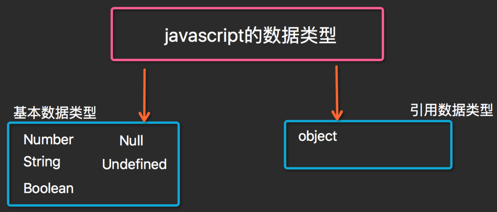
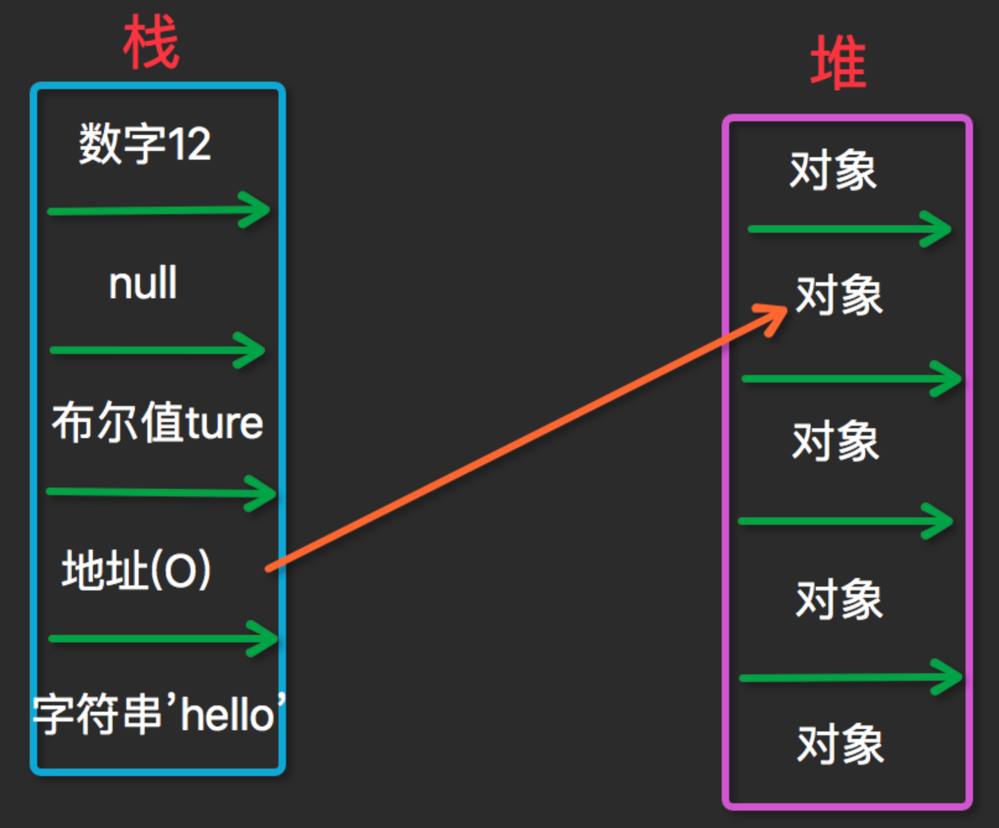

[TOC]

#javaScript概况

js是一个基于对象的语言

# 引入

```html
//引入方式1：
<script src = "index.js">
</script>

//引入方式2：
<script>
alert("12312312");
</script>
```

# 关键字



# 函数声明



# 数据类型






```js
number     -----  数值

boolean    -----  布尔值
string     -----  字符串
undefined  -----  undefined
if (2>1){
    	alert("true");
    }else if{
      alert("false");
}
  
  
null       -----   null  
```


# 逻辑运算

```
算术运算符：
    +   -    *    /     %       ++        -- 

比较运算符：
    >   >=   <    <=    !=    ==    ===   !==

逻辑运算符：
     &&   ||   ！

赋值运算符：
    =  +=   -=  *=   /=

字符串运算符：
    +  连接，两边操作数有一个或两个是字符串就做连接运算
```

# 流程控制

## if-else if-else

```JS
var score=window.prompt("您的分数:");

if (score>90){
    ret="优秀";
}else if (score>80){
    ret="良";
}else if (score>60){
    ret="及格";
}else {
    ret = "不及格";

}
alert(ret);
```

## switch-case

```js
switch(x){
case 1:y="星期一";    break;
case 2:y="星期二";    break;
case 3:y="星期三";    break;
case 4:y="星期四";    break;
case 5:y="星期五";    break;
case 6:y="星期六";    break;
case 7:y="星期日";    break;
default: y="未定义";
}
```

## while和for

```js
//同样支持continue与break语句
//循环输出H1到H7的字体大小
var i=1;
while (i<=7) {
    document.write("<H"+i+">hello</H "+i+"> ");
    document.write("<br>");
    i++;
}


for( 变量 in 数组或对象)
    {
        执行语句
        ……
    }
for(初始表达式;条件表达式;自增或自减)
{
  执行语句
  ……
}
```

# 异常处理

```js
try {
    //这段代码从上往下运行，其中任何一个语句抛出异常该代码块就结束运行
}
catch (e) {
    // 如果try代码块中抛出了异常，catch代码块中的代码就会被执行。
    //e是一个局部变量，用来指向Error对象或者其他抛出的对象
}
finally {
     //无论try中代码是否有异常抛出（甚至是try代码块中有return语句），finally代码块中始终会被执行。
}
```

