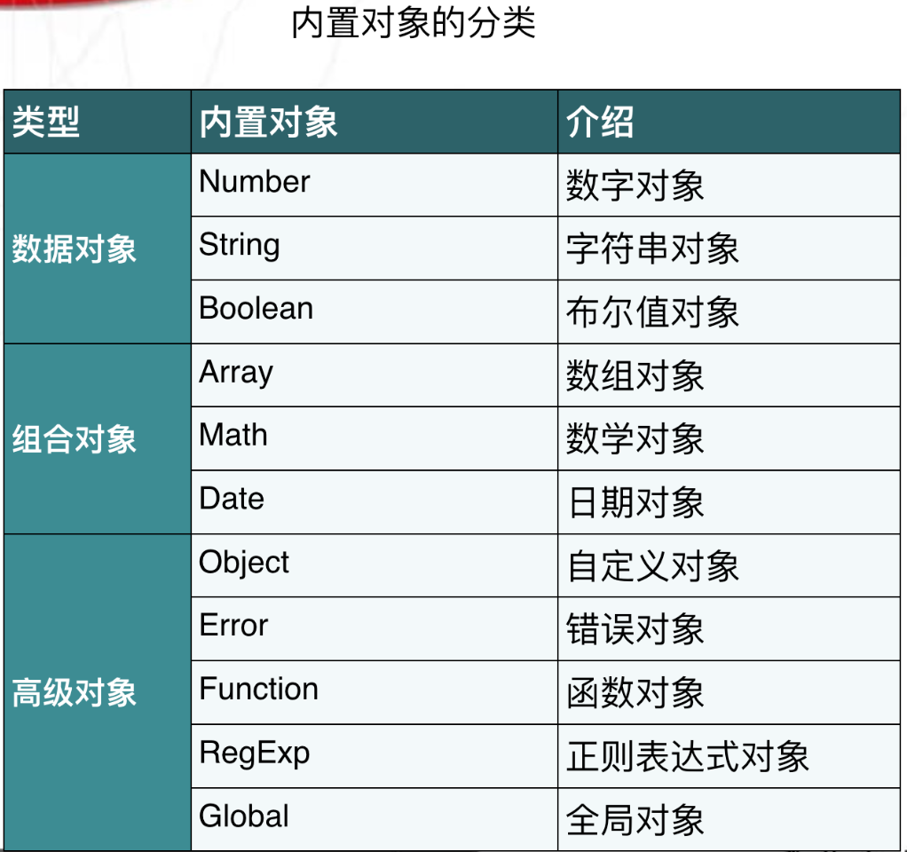

[TOC]

# ECMAScript核心标准简介

```
<script language="javascript">
var aa=Number.MAX_VALUE; 
//利用数字对象获取可表示最大数
var bb=new String("hello JavaScript"); 
//创建字符串对象
var cc=new Date();
//创建日期对象
var dd=new Array("星期一","星期二","星期三","星期四"); 
//数组对象
</script>
```



# string对象

## 创建

```
var str1="hello world";
var str1= new String("hello word");
```

## 字符串对象的属性和函数

### 基本属性

```js
x.length         －－－－获取字符串的长度

 x.toLowerCase()        －－－－转为小写
 x.toUpperCase()        －－－－转为大写
 x.trim()               －－－－去除字符串两边空格       
```


### 内置方法

```js
－－－－字符串查询方法

x.charAt(index)         －－－－str1.charAt(index);－－－－获取指定位置字符，其中index为要获取的字符索引

x.indexOf(findstr,index)－－－－查询字符串位置
x.lastIndexOf(findstr)  

x.match(regexp)         －－－－match返回匹配字符串的数组，如果没有匹配则返回null
x.search(regexp)        －－－－search返回匹配字符串的首字符位置索引

    示例：
    var str1="welcome to the world of JS!";
    var str2=str1.match("world");
    var str3=str1.search("world");
    alert(str2[0]);  // 结果为"world"
    alert(str3);     // 结果为15
                        
－－－－子字符串处理方法

x.substr(start, length) －－－－start表示开始位置，length表示截取长度
x.substring(start, end) －－－－end是结束位置
x.slice(start, end)     －－－－切片操作字符串
    示例：
    var str1="abcdefgh";
    var str2=str1.slice(2,4);
    var str3=str1.slice(4);
    var str4=str1.slice(2,-1);
    var str5=str1.slice(-3,-1);

    alert(str2); //结果为"cd"
    alert(str3); //结果为"efgh"
    alert(str4); //结果为"cdefg"
    alert(str5); //结果为"fg"


x.replace(findstr,tostr) －－－－    字符串替换、
x.split();                 －－－－分割字符串
    var str1="一,二,三,四,五,六,日"; 
    var strArray=str1.split(",");
    alert(strArray[1]);//结果为"二"
                                
x.concat(addstr)         －－－－    拼接字符串
```

# array对象

## 数组创建

```js
创建方式1:
var arrname = [元素0,元素1,….];          // var arr=[1,2,3];

创建方式2:
var arrname = new Array(元素0,元素1,….); // var test=new Array(100,"a",true);

创建方式3:
var arrname = new Array(长度); 

    //  初始化数组对象:
    var cnweek=new Array(7);
      cnweek[0]="星期日";
      cnweek[1]="星期一";
      ...
      cnweek[6]="星期六";

//创建二维数组
var cnweek=new Array(7);
for (var i=0;i<=6;i++){
    cnweek[i]=new Array(2);
}
cnweek[0][0]="星期日";
cnweek[0][1]="Sunday";
cnweek[1][0]="星期一";
cnweek[1][1]="Monday";
...
cnweek[6][0]="星期六";
cnweek[6][1]="Saturday";
```

### 基本属性与内置方法

#### join

```js
x.join(bystr)       －－－－将数组元素拼接成字符串

                            var arr1=[1, 2, 3, 4, 5, 6, 7];
                var str1=arr1.join("-");
                alert(str1);  //结果为"1-2-3-4-5-6-7" 
```

#### concat

```js
x.concat(value,...)    －－－－ 
                   var a = [1,2,3];
                  var b=a.concat(4,5) ;
                  alert(a.toString());  //返回结果为1,2,3            
                  alert(b.toString());  //返回结果为1,2,3,4,5
```

#### 排序-reverse sort

```JS
//x.reverse()
//x.sort()

var arr1=[32, 12, 111, 444];
//var arr1=["a","d","f","c"];

arr1.reverse(); //颠倒数组元素
alert(arr1.toString());
//结果为444,111,12,32

arr1.sort();    //排序数组元素
alert(arr1.toString());
//结果为111,12,32,444

//------------------------------
arr=[1,5,2,100];

//arr.sort();
//alert(arr);
//如果就想按着数字比较呢?

function intSort(a,b){
    if (a>b){
        return 1;//-1
    }
    else if(a<b){
        return -1;//1
    }
    else {
        return 0
    }
}

arr.sort(intSort);

alert(arr);

function IntSort(a,b){
    return a-b;
}
```

#### 数组切片

```JS
//x.slice(start, end)
//
//使用注解
//
//x代表数组对象
//start表示开始位置索引
//end是结束位置下一数组元素索引编号
//第一个数组元素索引为0
//start、end可为负数，-1代表最后一个数组元素
//end省略则相当于从start位置截取以后所有数组元素

var arr1=['a','b','c','d','e','f','g','h'];
var arr2=arr1.slice(2,4);
var arr3=arr1.slice(4);
var arr4=arr1.slice(2,-1);

alert(arr2.toString());
//结果为"c,d" 
alert(arr3.toString());
//结果为"e,f,g,h"
alert(arr4.toString());
//结果为"c,d,e,f,g"
```

#### 删除子数组

```JS
//x. splice(start, deleteCount, value, ...)

//使用注解

//x代表数组对象
//splice的主要用途是对数组指定位置进行删除和插入
//start表示开始位置索引
//deleteCount删除数组元素的个数
//value表示在删除位置插入的数组元素
//value参数可以省略       
        
var a = [1,2,3,4,5,6,7,8];
a.splice(1,2);

alert(a.toString());//a变为 [1,4,5,6,7,8]

a.splice(1,1);

alert(a.toString());//a变为[1,5,6,7,8]

a.splice(1,0,2,3);

alert(a.toString());//a变为[1,2,3,5,6,7,8]
```

#### 数组的push和pop

```JS
//push pop这两个方法模拟的是一个栈操作

//x.push(value, ...)  压栈
//x.pop()             弹栈      
//使用注解
//
//x代表数组对象
//value可以为字符串、数字、数组等任何值
//push是将value值添加到数组x的结尾
//pop是将数组x的最后一个元素删除


var arr1=[1,2,3];
arr1.push(4,5);
alert(arr1);
//结果为"1,2,3,4,5"
arr1.push([6,7]);
alert(arr1)
//结果为"1,2,3,4,5,6,7"
arr1.pop();
alert(arr1);
//结果为"1,2,3,4,5"
```

#### 数组的shift和unshift

```JS
//x.unshift(value,...)
//x.shift()
//使用注解

//x代表数组对象
//value可以为字符串、数字、数组等任何值
//unshift是将value值插入到数组x的开始
//shift是将数组x的第一个元素删除

var arr1=[1,2,3];
arr1.unshift(4,5);
alert(arr1);  //结果为"4,5,1,2,3"

arr1. unshift([6,7]);
alert(arr1);  //结果为"6,7,4,5,1,2,3"

arr1.shift();
alert(arr1);  //结果为"4,5,1,2,3"
```

#### 数组的特性

```JS
//  js中数组的特性
         //java中数组的特性,  规定是什么类型的数组,就只能装什么类型.只有一种类型.
         //js中的数组特性1: js中的数组可以装任意类型,没有任何限制.
         //js中的数组特性2: js中的数组,长度是随着下标变化的.用到多长就有多长.
         var arr5 = ['abc',123,1.14,true,null,undefined,new String('1213'),new Function('a','b','alert(a+b)')];
        /*  alert(arr5.length);//8
         arr5[10] = "hahaha";
         alert(arr5.length); //11
         alert(arr5[9]);// undefined */
```

# data对象

## 创建date对象

```js
//方法1：不指定参数
var nowd1=new Date();
alert(nowd1.toLocaleString( ));
//方法2：参数为日期字符串
var nowd2=new Date("2004/3/20 11:12");
alert(nowd2.toLocaleString( ));
var nowd3=new Date("04/03/20 11:12");
alert(nowd3.toLocaleString( ));
//方法3：参数为毫秒数
var nowd3=new Date(5000);
alert(nowd3.toLocaleString( ));
alert(nowd3.toUTCString());

//方法4：参数为年月日小时分钟秒毫秒
var nowd4=new Date(2004,2,20,11,12,0,300);
alert(nowd4.toLocaleString( ));//毫秒并不直接显示
```

## date的属性与方法

### Date对象的方法—获取日期和时间

```JS
获取日期和时间
getDate()                 获取日
getDay ()                 获取星期
getMonth ()               获取月（0-11）
getFullYear ()            获取完整年份
getYear ()                获取年
getHours ()               获取小时
getMinutes ()             获取分钟
getSeconds ()             获取秒
getMilliseconds ()        获取毫秒
getTime ()                返回累计毫秒数(从1970/1/1午夜)

function getCurrentDate(){
        //1. 创建Date对象
        var date = new Date(); //没有填入任何参数那么就是当前时间
        //2. 获得当前年份
        var year = date.getFullYear();
        //3. 获得当前月份 js中月份是从0到11.
        var month = date.getMonth()+1;
        //4. 获得当前日
        var day = date.getDate();
        //5. 获得当前小时
        var hour = date.getHours();
        //6. 获得当前分钟
        var min = date.getMinutes();
        //7. 获得当前秒
        var sec = date.getSeconds();
        //8. 获得当前星期
        var week = date.getDay(); //没有getWeek
        // 2014年06月18日 15:40:30 星期三
        return year+"年"+changeNum(month)+"月"+day+"日 "+hour+":"+min+":"+sec+" "+parseWeek(week);
    }

alert(getCurrentDate());

//解决 自动补齐成两位数字的方法
    function changeNum(num){
    if(num < 10){
        return "0"+num;
    }else{
        return num;
    }

}
//将数字 0~6 转换成 星期日到星期六
    function parseWeek(week){
    var arr = ["星期日","星期一","星期二","星期三","星期四","星期五","星期六"];
    //             0      1      2      3 .............
    return arr[week];
}
```

### Date对象的方法—设置日期和时间

```JS
//设置日期和时间
//setDate(day_of_month)       设置日
//setMonth (month)                 设置月
//setFullYear (year)               设置年
//setHours (hour)         设置小时
//setMinutes (minute)     设置分钟
//setSeconds (second)     设置秒
//setMillliseconds (ms)       设置毫秒(0-999)
//setTime (allms)     设置累计毫秒(从1970/1/1午夜)
    
var x=new Date();
x.setFullYear (1997);    //设置年1997
x.setMonth(7);        //设置月7
x.setDate(1);        //设置日1
x.setHours(5);        //设置小时5
x.setMinutes(12);    //设置分钟12
x.setSeconds(54);    //设置秒54
x.setMilliseconds(230);        //设置毫秒230
document.write(x.toLocaleString( )+"<br>");
//返回1997年8月1日5点12分54秒

x.setTime(870409430000); //设置累计毫秒数
document.write(x.toLocaleString( )+"<br>");
//返回1997年8月1日12点23分50秒
```

### Date对象的方法—日期和时间的转换

````JS
日期和时间的转换:

getTimezoneOffset():8个时区×15度×4分/度=480;
返回本地时间与GMT的时间差，以分钟为单位
toUTCString()
返回国际标准时间字符串
toLocalString()
返回本地格式时间字符串
Date.parse(x)
返回累计毫秒数(从1970/1/1午夜到本地时间)
Date.UTC(x)
返回累计毫秒数(从1970/1/1午夜到国际时间)
````

# math对象

```js
//该对象中的属性方法 和数学有关.

abs(x)    返回数的绝对值。
exp(x)    返回 e 的指数。
floor(x)对数进行下舍入。
log(x)    返回数的自然对数（底为e）。
max(x,y)    返回 x 和 y 中的最高值。
min(x,y)    返回 x 和 y 中的最低值。
pow(x,y)    返回 x 的 y 次幂。
random()    返回 0 ~ 1 之间的随机数。
round(x)    把数四舍五入为最接近的整数。
sin(x)    返回数的正弦。
sqrt(x)    返回数的平方根。
tan(x)    返回角的正切。

//方法练习:
        //alert(Math.random()); // 获得随机数 0~1 不包括1.
        //alert(Math.round(1.5)); // 四舍五入
        //练习：获取1-100的随机整数，包括1和100
             //var num=Math.random();
             //num=num*10;
             //num=Math.round(num);
             //alert(num)
        //============max  min=========================
        /* alert(Math.max(1,2));// 2
        alert(Math.min(1,2));// 1 */
        //-------------pow--------------------------------
        alert(Math.pow(2,4));// pow 计算参数1 的参数2 次方.
```

# function对象

## 定义

```js
function 函数名 (参数){
<br>    函数体;
    return 返回值;
}
	
var 函数名 = new Function("参数1","参数n","function_body");


//js的函数加载执行与python不同，它是整体加载完才会执行，所以执行函数放在函数声明上面或下面都可以：
<script>
    //f(); --->OK
    function f(){
        console.log("hello")
    }
    f() //----->OK
</script>
```

## function对象的属性

function函数是一个引用类型，所以它们也有属性和方法。
比如，ECMAScript 定义的属性 length 声明了函数期望的参数个数。

`alert(func1.length)`

## function调用

```JS
function func1(a,b){
    alert(a+b);
}

    func1(1,2);  //3
    func1(1,2,3);//3
    func1(1);    //NaN
    func1();     //NaN

    //只要函数名写对即可,参数怎么填都不报错.
-------------------面试题-----------
 function a(a,b){
    alert(a+b);
}
   var a=1;
   var b=2;
   a(a,b)
```

## function的 内置对象arguments

```js
function add(a,b){

        console.log(a+b);//3
        console.log(arguments.length);//2
        console.log(arguments);//[1,2]

    }
    add(1,2)

    ------------------arguments的用处1 ------------------
    function nxAdd(){
        var result=0;
        for (var num in arguments){
            result+=arguments[num]
        }
        alert(result)

    }

    nxAdd(1,2,3,4,5)

//     ------------------arguments的用处2 ------------------

    function f(a,b,c){
        if (arguments.length!=3){
            throw new Error("function f called with "+arguments.length+" arguments,but it just need 3 arguments")
        }
        else {
            alert("success!")
        }
    }

    f(1,2,3,4,5)
```

## 匿名函数

```js
// 匿名函数
    var func = function(arg){
        return "tony";
    }

// 匿名函数的应用
    (function(){
        alert("tony");
    } )()

    (function(arg){
        console.log(arg);
    })('123')
```

