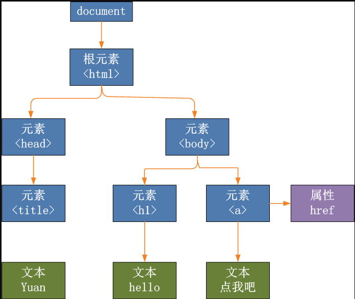
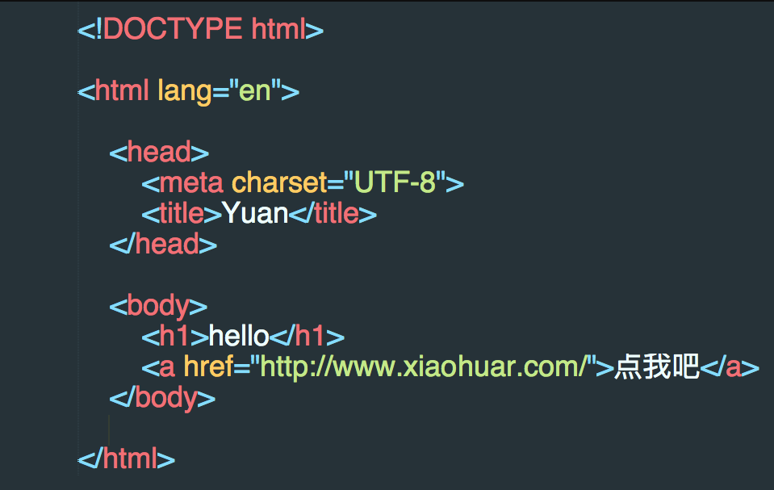
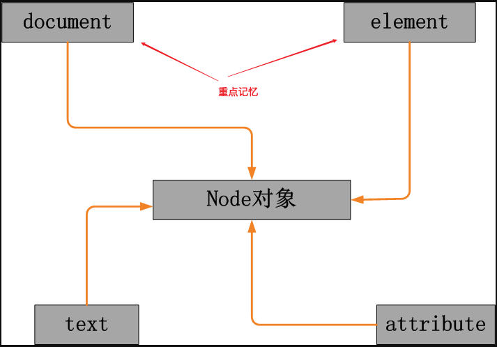
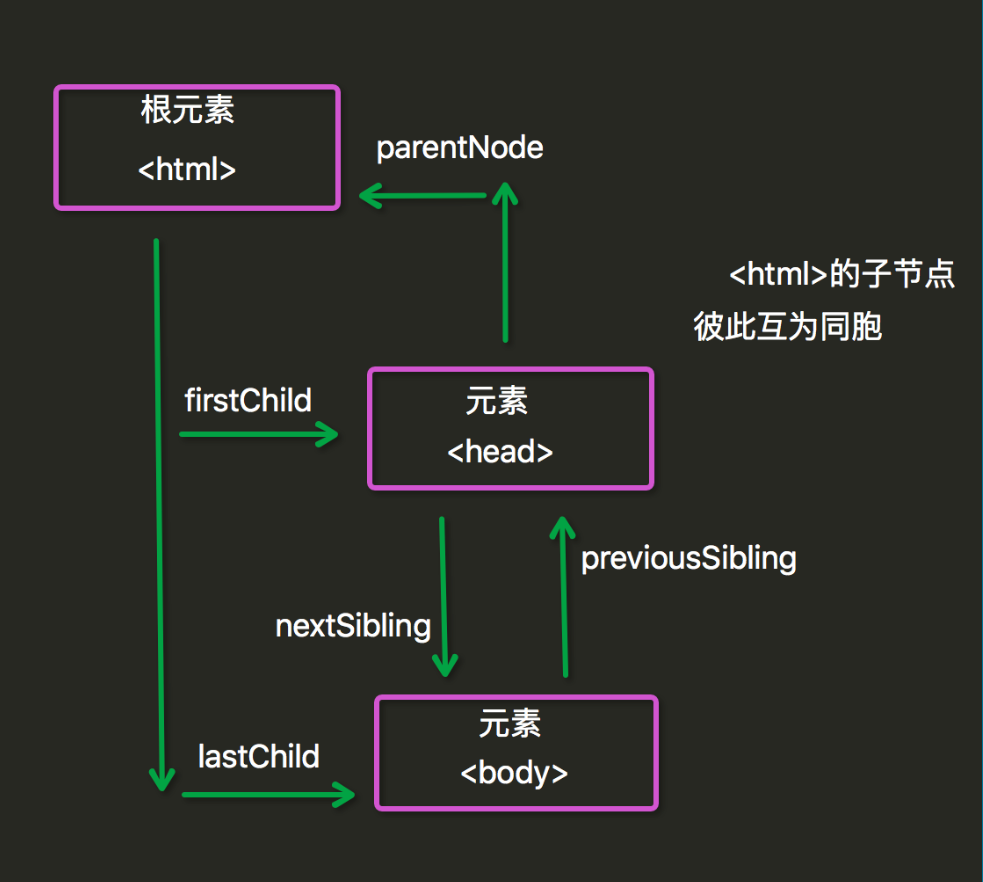

[TOC]

# DOM对象

>   HTML DOM 定义了访问和操作HTML文档的标准方法
>
>   HTML DOM 把 HTML 文档呈现为带有元素、属性和文本的树结构（节点树)
>
>   HTML  Document Object Model（文档对象模型）

-  document文档对象
-  element标签对象
-  属性对象
-  文本对象
- 注释对象

## DOM树

> 画DOM树就是为了展示文档中各个对象之间的关系，用于对象的导航





## DOM节点

### 节点类型

HTML 文档中的每个成分都是一个节点。

DOM 是这样规定的：
    整个文档是一个文档节点
    每个 HTML 标签是一个元素节点
    包含在 HTML 元素中的文本是文本节点
    每一个 HTML 属性是一个属性节点



### 节点关系

> 节点树中的节点彼此拥有层级关系。
>
> 父(parent),子(child)和同胞(sibling)等术语用于描述这些关系。父节点拥有子节点。同级的子节点被称为同胞（兄弟或姐妹）。

- ​    在节点树中，顶端节点被称为根（root）
- ​    每个节点都有父节点、除了根（它没有父节点）
- ​    一个节点可拥有任意数量的子
- ​    同胞是拥有相同父节点的节点

下面的图片展示了节点树的一部分，以及节点之间的关系：




### document文档对象和element标签对象

#### *直接查找

##### document.getElementById() //根据id查找标签

##### document.getElementsByClassName() //根据classname查找标签

##### document.getElementsByTagName() //根据tag查找标签

##### document.getElementsByName();//根据name查找标签，用的比较少

```js
//4种查询标签的方式
document.getElementById() //根据id查找标签
document.getElementsByClassName() //根据classname查找标签
document.getElementsByTagName() //根据tag查找标签
document.getElementsByName();//根据name查找标签，用的比较少

示例： -------
<!DOCTYPE html>
<html lang="en">
<head>
    <meta charset="UTF-8">
    <title>Title</title>
</head>
<body>
<div class="item">111</div>
<div class="item">222</div>
<div class="item">333</div>
<div class="item">444</div>
<div class="item">555</div>
<p id="p1">pppp</p>
</body>
//代码从上到下执行，所以script，需要写到下面。一般放到要操作的html下面
<script>
            var ele=document.getElementById("p1");
            var ele2=document.getElementsByClassName("item");
        console.log(ele);
        console.log(ele2);
</script>
</html>
```

#### 导航查找

##### parentElement  // 父节点标签元素

##### children   // 所有子标签

##### firstElementChild // 第一个子标签元素

##### lastElementChild  // 最后一个子标签元素

##### nextElementtSibling // 下一个兄弟标签元素

##### previousElementSibling  // 上一个兄弟标签元素

>注意，js中没有办法找到所有的兄弟标签！

```js
<div class="box1">
    <div class="box2">
        <div class="box3_div" id="div3">div3</div>
        <p class="box2_p"></p>
        <p class="box2_p"></p>
        <p class="box2_p"></p>
        <p class="box2_p"></p>
    </div>
</div>

</body>

<script>
    var ele = document.getElementById("div3");
    //父标签
   var ele1 =  ele.parentElement;
   //父标签的父标签
   var ele2 =  ele.parentElement.parentElement;
   //父标签的父标签的孩子标签
   var ele3 =  ele.parentElement.parentElement.firstElementChild;
   //下一个兄弟标签
   var ele4 =  ele.parentElement.parentElement.nextElementtSibling;
    //父标签的父标签的全部子标签
   var ele5 =  ele.parentElement.children;
    console.log(ele1);
    console.log(ele2);
    console.log(ele3);
    console.log(ele4);
    console.log(ele5);

</script>
```

#### 绑定事件方式

- onclick 单击事件
- ondblclick 双击事件

```html
方式1：
function func(){}
<ele onclick="func()">
```

```html

方式2，格式：标签对象.事件=函数
<body>

<div id="abc">id</div>
<div class="item">111</div>
<div class="item">222</div>
<div class="item">333</div>

</body>
<script>
    //为单个标签绑定事件
var ele =document.getElementById("abc");
    ele.onclick=function () {
        alert("12312312")
      	console.log(this) //获取当前标签的内容，只能在绑定事件的函数里面用
    };

    //为多个标签绑定事件
    var ele2 = document.getElementsByClassName("item");
    for (var i=0;i<ele2.length;i++){
        ele2[i].onclick=function () {
            alert("111111")
        };
    }
</script>
```

### 关于标签的操作

#### 文本操作

- innerHTML属性---给节点添加html代码
- innerText属性

```HTML
<div class="c1">
    <p>ppp</p>
</div>

</body>
<script>
    var ele = document.getElementsByClassName("c1")[0];
    console.log(ele.innerHTML); //<p>ppp</p>
    console.log(ele.innerText); //ppp
    ele.innerText="<a href=''>点击1</a>";  //把一个a标签文本重新赋值给 ele，前端显示“a标签文本”

    ele.innerHTML="<a href=''>点击2</a>"; //把一个a标签html重新赋值给 ele，会显示html解析后的效果

</script>
```

#### 节点操作

##### 创建节点- createElement

##### 添加节点- appendChild

```js
//创建并添加的功能
//1. 先找到对应的标签
var ele = document.getElementsByTagName("button")[0];
// 悬浮事件
ele.onmouseover=function(){
  //2. 创建一个img节点
  var ele_img = document.createElement("img");//

  //3. 标签属性赋值
  ele_img.src="./WechatIMG6.jpeg";

  //4. 将img节点添加到div中
  var ele_f=document.getElementsByClassName("add_node")[0];
  ele_f.appendChild(ele_img);
};
```

##### 删除节点- removeChild

```JS
//删除的功能
//1. 找到button标签
var ele2 = document.getElementsByTagName("button")[1];
//2. 找到需要删除的标签的父标签
var ele2_f=document.getElementsByClassName("add_node")[0];
//3. 绑定事件
ele2.onclick=function(){
  //4. 找到该标签
  var ele_h1 = document.getElementsByTagName("h1")[0];
  //5. 需要从父标签中删除h1
  ele2_f.removeChild(ele_h1);
};

```

##### 替换节点- replaceChild

```JS
//替换功能
//1. 先找到对应的标签
var ele3 = document.getElementsByTagName("button")[0];
//2. 悬浮事件
ele3.onmouseover=function() {
  //3. 创建一个新的节点,并赋值
  var ele_img2 = document.createElement("img");//
  ele_img2.src = "./WechatIMG6.jpeg";
  //4. 找到该节点
  var ele_h12 = document.getElementsByTagName("h1")[0];
  //5. 替换掉
  ele_f.replaceChild(ele_img2, ele_h12)
}
```


#### 节点属性操作-attribute操作

elemenetNode.属性名=属性值

```js
elementNode.setAttribute(name,value)    
elementNode.getAttribute(属性名)        <-------------->elementNode.属性名(DHTML)
elementNode.removeAttribute(“属性名”);

//实例；
//创建一个img节点
var ele_img = document.createElement("img");//

//标签属性赋值
ele_img.src="./WechatIMG6.jpeg";
```

#### value获取当前选中的value值

```JS
1.input   
2.select （selectedIndex）
3.textarea 
```

#### class操作

```
elementNode.className  
elementNode.classList.add() //添加一个label
elementNode.classList.remove()  //删除classname的一个label
```

#### 改变css样式

```HTML
<p id="p2">Hello world!</p>
document.getElementById("p2").style.color="blue";
                             .style.fontSize=48px
```

### 实现一个左侧栏，点击展开的功能

```html
<!DOCTYPE html>
<html lang="en">
<head>
    <meta charset="UTF-8">
    <title>Title</title>
    <style>
        .left_menu{
            width: 20%;
            height: 500px;
            background: aliceblue;
            float: left;
        }
        .content_menu{
            width: 80%;
            height: 500px;
            background-color: beige;
            float: left;
        }
        .title{
            text-align: center;
            background-color:rebeccapurple;
            line-height: 30px;
            color: white;
        }
        .hide{
            display: none;
        }
        .item{
            margin: 20px;
        }
    </style>
</head>
<body>

<div class="outer">
    <div class="left_menu">
        <div class="item">
            <div class="title">菜单1</div>
            <div class="con">
                <p>1111</p>
                <p>1111</p>
                <p>1111</p>
                <p>1111</p>
                <p>1111</p>
            </div>
        </div>
         <div class="item">
            <div class="title">菜单2</div>
            <div class="con hide">
                <p>2222</p>
                <p>2222</p>
                <p>2222</p>
                <p>2222</p>
                <p>2222</p>
            </div>
        </div>
                 <div class="item">
            <div class="title">菜单3</div>
            <div class="con hide">
                <p>3333</p>
                <p>3333</p>
                <p>3333</p>
                <p>3333</p>
                <p>3333</p>
            </div>
        </div>
    </div>
    <div class="content_menu"></div>
</div>
</body>
<script>
    var eles  = document.getElementsByClassName("title"); //找到对应的classname标签的array
    for (var i=0;i<eles.length;i++){ 
        eles[i].onclick=function () { //循环添加一个点击事件
          	//找到他的标签的下一个标签，然后删除hide这个classname
            this.nextElementSibling.classList.remove("hide"); //this是自己的标签
            //找到他爷爷的标签下面的全部孩子array
            var yearray = this.parentElement.parentElement.children;
            //找到他爹的标签
            var ele_curr_p=this.parentElement;

            for (var b=0;b<yearray.length;b++){ //循环他爷爷的标签的全部孩子array
                if (yearray[b] != ele_curr_p){ //判断他爹是不是他爹
                    yearray[b].children[1].classList.add("hide"); //给不是他爹的标签的孩子添加的classname添加一个hide值
                }
            }
        }
    }
</script>
</html>
```

### 模态对话框

