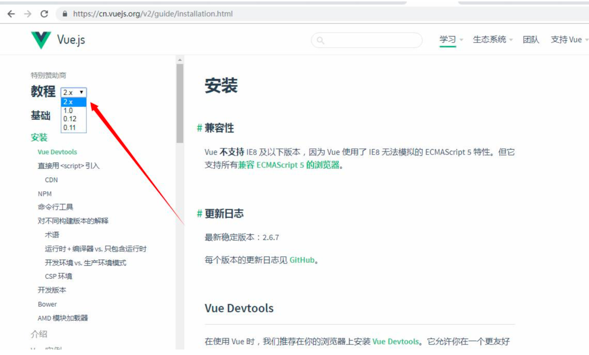
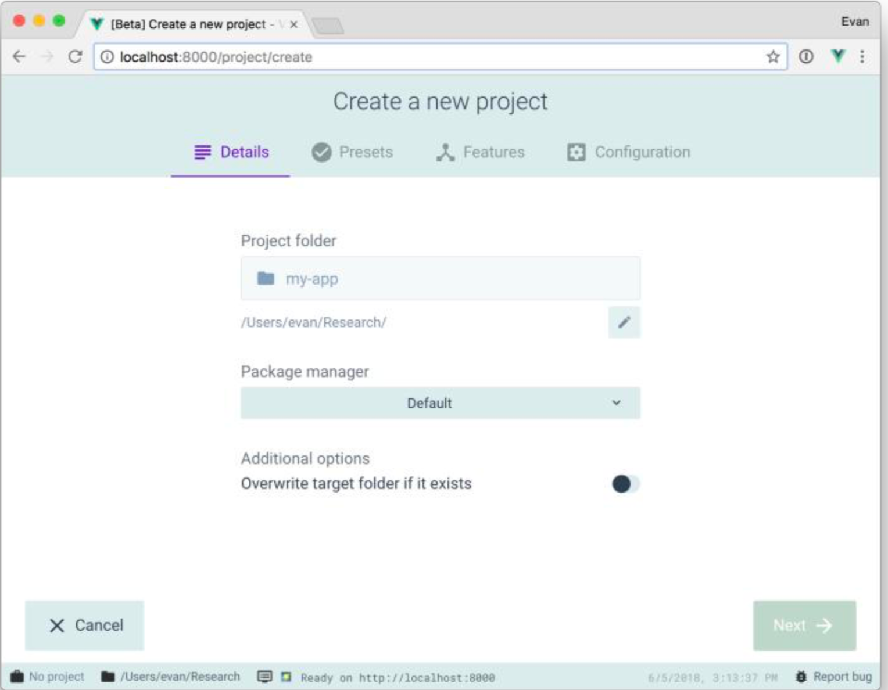

[toc]

# Cnpm 安装使用

```shell
地址：http://npm.taobao.org/
安装cnpm:
npm install -g cnpm --registry=https://registry.npm.taobao.org
```

#  关于 **Vue CLI3** 和 **Vue CLI2** 以及 **Vue2.x Vue3.x**

Vue Cli 安装 vue 的脚手架工具，也就是官方命令行工具，可以用命令快速创建项目。

注意:Vue CLI 3 是 Vue CLI 2 的升级版本，并不是 Vue3.0 。 Vue3.0 目前(2019 年 3 月 5 日)还没有正式发布。Vue CLI 3 和老版本的 Vue ClI 创建的项目方式是不一样的， 创建项目的用法是一样的。Vue CLI 3 在项目编译速度上面做了一些优化。无论你用哪个版 本的 ClI，Vue3.0 发布之前写代码的方式都是一样的。目前 Vue3.0 还在重写中，暂时还没 有任何消息，Vue3.0 发布后我们会第一时间更新教程。



# 安装以及创建项目

## **Vue CLI** 旧版本的安装以及创建项目(目前可以继 续使用)

**1、搭建 vue 的开发环境 ，安装 vue 的脚手架工具 官方命令行工具**
```shell
首先：必须安装nodejs/npm/cnpm

npm install --global vue-cli
#或者：
cnpm install --global vue-cli #（此命令只需要执行一次）
```

**2、创建项目 必须 cd 到对应的一个项目里面**
```shell
vue init webpack vue-demo01
cd  vue-demo01 
#如果创建项目的时候没有报错，这一步可以省略。如果报错了  cd到项目里面运行  cnpm install   /  npm install
cnpm install # 或者：npm install   
npm run dev
```

**3、另一种创建项目的方式 (推荐) \**\***
```shell
vue init webpack-simple vuedemo02
cd  vuedemo02
cnpm install   /  npm install        
npm run dev
```

## **Vue CLI 3** 的安装以及创建项目

 Vue Cli3 官网:https://cli.vuejs.org/zh/guide/installation.html

**Node** 版本要求:Vue CLI 3 需要 Node.js 8.9 或更高版本 (推荐 8.11.0+)。你可以使用 nvm 或 nvm-windows 在同一台电脑中管理多个 Node 版本

**1**、装 **vue** 的脚手架工具(**Vue Cli3**) 官方命令行工具

```shell
npm install -g @vue/cli 
# 或者:  
cnpm install -g @vue/cli
# 或者:  
yarn global add @vue/cli
```

**2**、创建项目 **必须 cd 到对应的一个项目里面**

```shell
vue create hello-world 
# 运行: 
npm run serve 
# 编译:
npm run build
```

### **Vue CLI 3** 图形化界面创建项目




