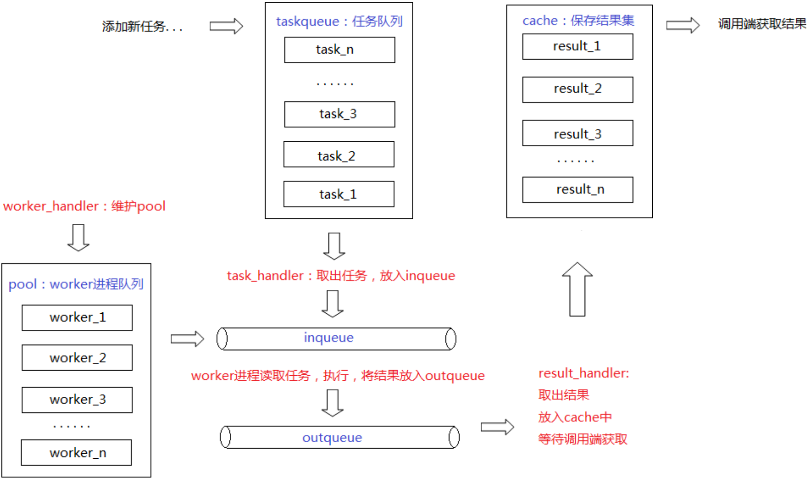
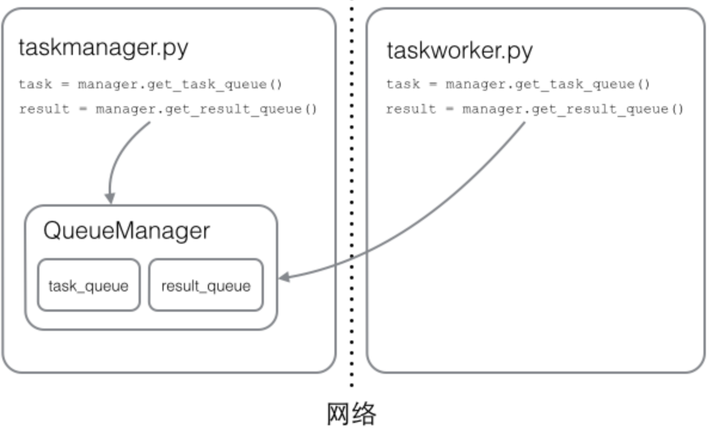

----

* [模块由来](#模块由来)

* [简单介绍](#简单介绍)

* [创建进程](#创建进程)

  * [创建方式](#创建方式)
  * [属性方法](#属性方法)

* [创建进程池](#创建进程池)

  * [模拟实现](#模拟实现)
  * [真实架构](#真实架构)
  * [创建方式](#创建方式)
  * [属性方法](#属性方法)

* [创建线程](#创建线程)

* [进程间资源共享](#进程间资源共享)

  * [Pipe](#Pipe)
  * [Queue](#Queue)
  * [Value](#Value)
  * [Array](#Array)
  * [Manager](#Manager)

* [进程间竞态同步](#进程间竞态同步)

  * [非进程池](#非进程池)

    * [Lock](#Lock)
    * [RLock](#RLock)
    * [Semaphore](#Semaphore)
    * [Event](Event)
    * [Condition](#Condition)

  * [进程池](#进程池)

    * [巧用initializer和initargs](#巧用initializer和initargs)

  * [分布式应用支持](#分布式应用支持)
    
    * [常规套路](#常规套路)

  * [踩坑日记](#踩坑日记)

---

# 模块由来

> Python默认使用全局解释锁GIL保护解释器内置状态数据,例如引用计数,导致同一时间只能有一个线程操作解释器,所以所谓的多线程只能利用单核,为了充分利用多核,通常会配合多进程

# 简单介绍

> 内置模块,简化多进程,多线程代码编写,支持进线程间通信,共享,同步等特性

# 创建进程

## 创建方式

* 直接通过multiprocessing.Process创建

| 方法                                                         | 说明                                                         |
| ------------------------------------------------------------ | ------------------------------------------------------------ |
| Process(group=None, target=None, name=None, args=(), kwargs={}) | group未实现可忽略,target为目标函数或方法,name为进程名,args为target的位置参数,kwargs为target为命名参数 |

```python
#! -*- coding: utf-8 -*-


# author: forcemain@163.com


import multiprocessing


def execute_cmd(cmd, **kwargs):
    # 获取当前运行的进程对象
    p = multiprocessing.current_process()
    print 'Process({0}#{1}) execute cmd: {2}'.format(p.name, p.pid, cmd)


if __name__ == '__main__':
    # 创建一个
    # 进程名为cmd-executor
    # 目标函数为execute_cmd
    # 目标函数位置参数为('pwd',)
    # 目标函数命名参数为{}
    # 子进程对象
    p = multiprocessing.Process(name='cmd-executor', target=execute_cmd, args=('pwd',), kwargs={})
    # 启动子进程
    p.start()
    # 等待子进程结束后再继续执行下面的代码
    p.join()
```

* 继承multiprocessing.Process子类创建

````python
#! -*- coding: utf-8 -*-


# author: forcemain@163.com


import multiprocessing


class ExecuteCmdProcess(multiprocessing.Process):
    def __init__(self, **kwargs):
        super(ExecuteCmdProcess, self).__init__(**kwargs)
        # 获取cmd
        self._cmd = self._args[0]

    # 其实通过multiprocessing.Process时候调用的即此方法
    def run(self):
        print 'Process({0}#{1}) execute cmd: {2}'.format(self.name, self.pid, self._cmd)


if __name__ == '__main__':
    # 创建一个
    # 进程名为cmd-executor
    # 目标函数位置参数为('pwd',)
    # 目标函数命名参数为{}
    # ExecuteCmdProcess子进程对象
    p = ExecuteCmdProcess(name='cmd-executor', args=('pwd',), kwargs={})
    # 启动子进程
    p.start()
    # 等待子进程结束后再继续执行下面的代码
    p.join()
````


## 属性方法

| 属性                 | 说明                                                         |
| -------------------- | ------------------------------------------------------------ |
| p.authkey            | 分布式调度时C/S间认证密钥                                    |
| p.daemon             | 当父进程结束时子进程是否强制结束                             |
| p.exitcode           | 进程运行状态返回None,执行成功返回0,被N信号中断返回-N         |
| p.name               | 进程名                                                       |
| p.pid                | 进程ID                                                       |
| p.is_alive()         | 判断进程是否存活                                             |
| p.join(timeout=None) | 阻塞当前进程,直到进程执行完毕或终止或者timeout超时           |
| p.start()            | 将进程加入调度队列,等待CPU调度                               |
| p.terminate()        | 无论任务是否完成,立即停止,需要注意的是调用之后必须再次调用.join()才能真正关闭子进程 |

```python
#! -*- coding: utf-8 -*-


# author: forcemain@163.com


import os
import multiprocessing


class ExecuteCmdProcess(multiprocessing.Process):
    def __init__(self, **kwargs):
        super(ExecuteCmdProcess, self).__init__(**kwargs)
        self._cmd = self._args[0]

    def run(self):
        # 模拟创建并读取100G数据,故意使其卡住
        with open('100G.dat', 'w+b') as f:
            f.seek(100*pow(1024, 3))
            f.write(os.linesep)
            f.seek(0)
            for _ in f:
                pass

if __name__ == '__main__':
    _timeout = 5
    p = ExecuteCmdProcess(name='cmd-executor', args=('cat 100G.dat',), kwargs={})
    p.daemon = True
    p.start()
    p.join(timeout=_timeout)
    p.terminate()
    # 注意调用.terminate()方法后一定要再次调用.join()才能真正关闭子进程,否则子进程此时会呈现"僵尸"状态
    p.join()
    print p.is_alive()
    print 'Process({0}#{1}) exit with {2} after {3} seconds'.format(p.name, p.pid, p.exitcode, _timeout)
```

# 创建进程池

> 进程的创建和销毁是非常消耗资源的,进程池不仅可以控制进程数量而且还可以控制进程创建和销毁,内部使用一个独立线程默认每隔0.1秒检测进程池内是否有需要清理的worker子进程,如果有则先清理然后在创建同等数量的新的worker子进程加入进程池,其实每个worker的主要任务就是每次从任务队列中取出任务执行再将结果写入结果队列,所以可以很容易控制worker子进程最大执行的任务数,超出则结束此worker子进程,独立线程检测到后立即清理并创建新的子进程

## 模拟实现

```python

#! -*- coding: utf-8 -*-


# author: forcemain@163.com


import time
import threading
import multiprocessing


# 工作进程目标函数
#   1. 从任务队列读取任务
#   2. 执行任务并将结果写入结果队列
def worker(qtask, qresult):
    while True:
        try:
            task = qtask.get()
            if task is None:
                print 'Recv stop signal from workers_check thread, gracefull exit'
                break
            func, args, kwargs, callback = task
        except Exception as e:
            print 'Get task from task_queue with exception, exp={0}'.format(e)
            break

        try:
            result = (True, func(*args, **kwargs))
        except Exception as e:
            result = (False, e)
        callable(callback) and callback(result)

        try:
            qresult.put(result)
        except Exception as e:
            print 'Put result to result queue with exception, exp={0}'.format(e)


# 进程池实现
class Pool(object):
    Process = multiprocessing.Process

    def __init__(self, max_processes=None):
        # 进程池最大进程数
        self._max_processes = max_processes or multiprocessing.cpu_count()

        # 进程池
        self._pool = []
        # 任务队列
        self._task_queue = multiprocessing.Queue()
        # 结果队列
        self._rest_queue = multiprocessing.Queue()

        self._workers_check = threading.Thread(
            target=Pool._check_workers,
            args=(self,)
        )

    # 模拟优雅退出,零时方案
    def start_workers_check(self):
        self._workers_check.daemon = True
        self._workers_check.start()

    @staticmethod
    def _check_workers(p):
        # 定期检查是否需要创建新的工作进程并创建
        while not p._task_queue.empty():
            print 'Task queue is not empty, keep checking'
            p._keep_workers()
            time.sleep(0.1)
        # 否则发送None使工作进程停止
        print 'Task queue is empty, notify all worker processes'
        map(lambda _: p._task_queue.put(None), p._pool)

    def _need_clean(self):
        clean = not self._pool
        for i in reversed(range(len(self._pool))):
            w = self._pool[i]
            # exitcode为None表示运行中
            if w.exitcode is not None:
                w.join()
                clean = True
                print 'Clean exit worker {0}'.format(w)
                # 清理已停止的进程
                del self._pool[i]
        return clean

    def _fill_workers(self):
        need_worker_num = self._max_processes - len(self._pool)
        for _ in xrange(need_worker_num):
            # 创建新的工作进程
            p = self.Process(
                target=worker,
                args=(self._task_queue, self._rest_queue)
            )
            p.name = p.name.replace('Process', '{0}{1}'.format(self.__class__.__name__, p.name))
            p.daemon = True
            # 加入进程池
            self._pool.append(p)
            p.start()
        print '{0} worker processes add to pool'.format(need_worker_num)

    def _keep_workers(self):
        self._need_clean() and self._fill_workers()

    def map(self, func, iterable, callback=None):
        map(lambda _: self._task_queue.put((func, (_,), {}, callback)), iterable)

    def join(self):
        self.start_workers_check()
        print 'Worker process check thread start'
        # 等待工作进程检查线程结束
        self._workers_check.join()
        # 等待工作进程关闭
        for p in self._pool:
            p.terminate()
            p.join()


def execute_cmd(cmd):
    p = multiprocessing.current_process()
    print '{0}#{1} execute cmd succ, cmd={2}'.format(p.name, p.pid, cmd)

    return cmd


def execute_cmd_callback(result):
    print 'Got result {0}'.format(result)

if __name__ == '__main__':
    p = Pool()
    # 模拟执行1万个命令执行
    p.map(execute_cmd, xrange(10000), execute_cmd_callback)
    p.join()
```

* 为了加深大家对进程池概念的理解,如上简单模拟进程池实现,但真正的进程池远不止这么简单,如下为完整内部架构图

## 真实架构



## 创建方式

| 方法                                                         | 说明                                                         |
| ------------------------------------------------------------ | ------------------------------------------------------------ |
| Pool(processes=None, initializer=None, initargs=(), maxtasksperchild=None) | processes为进程数,如果为None则默认为multiprocessing.cpu_count(),initializer和initargs忽略,maxtasksperchild为子进程生命周期内最大任务数,主要用于释放闲置资源,如果为None则表示进程一直存活 |

```python
#! -*- coding: utf-8 -*-


# author: forcemain@163.com


import multiprocessing


def execute_cmd(cmd):
    p = multiprocessing.current_process()
    print '{0}#{1} execute cmd succ, cmd={2}'.format(p.name, p.pid, cmd)

    return cmd


if __name__ == '__main__':
    p = multiprocessing.Pool()
    print p.map(execute_cmd, xrange(10000))
```

## 属性方法

| 方法                                                       | 说明                                                         |
| ---------------------------------------------------------- | ------------------------------------------------------------ |
| p.apply(func, args=(), kwds={})                            | 创建一个任务给进程池,阻塞模式,直接返回结果,func表示目标函数或方法,args表示func的位置参数,kwds表示func的命名参数 |
| p.apply_async(func, args=(), kwds={}, callback=None)       | 创建一个任务给进程池,非阻塞模式,返回ApplyResult对象,通过其get方法获取返回值,func表示目标函数或方法,args表示func的位置参数,kwds表示func的命名参数,callback表示回调函数或方法,用于异步回调模式 |
| p.map(func, iterable, chunksize=None)                      | 分组创建多个任务,阻塞模式,多进程无序执行但顺序返回,func表示目标函数或方法,iterable表示可迭代对象,chunksize表示分组创建任务,可忽略 |
| p.map_async(func, iterable, chunksize=None, callback=None) | 分组创建多个任务,非阻塞模式,多进程无序执行但顺序返回,func表示目标函数或方法,iterable表示可迭代对象,chunksize表示分组创建任务,可忽略,callback表示回调函数或方法,用于异步回调模式 |
| p.close()                                                  | 通过状态标志位_state声明不再处理新的任务                     |
| p.terminate()                                              | 同上,优雅关闭所有涉及的线程和子进程                          |
| p.join()                                                   | 等待相关进线协程都结束后再退出,调用它前需要先调用p.close()   |

* apply和apply_async的实现相对简单,首先创建一个ApplyResult结果对象,并携带结果对象序号_job写入\_taskqueue任务队列,\_handle_tasks任务处理器从任务队列取出放入\_inqueue进程处理队列,工作进程从进程处理队列中取出执行写入\_outqueue结果队列,\_handle_results结果处理器通过序号\_job找到对应的ApplyResult结果对象将结果\_set到对象
* map和map_async在上面的基础上在创建任务的时候_get_tasks配合chunksize对任务分组,工作进程收到的任务是分组形式的任务,然后子进程内通过mapstar(其实就是巧妙的调用了map)使一个工作进程可以按组执行任务

```python
#! -*- coding: utf-8 -*-


# author: forcemain@163.com


import multiprocessing


def execute_cmd(cmd):
    p = multiprocessing.current_process()
    print '{0}#{1} execute cmd succ, cmd={2}'.format(p.name, p.pid, cmd)

    return cmd


if __name__ == '__main__':
    p = multiprocessing.Pool(processes=multiprocessing.cpu_count())
    for i in xrange(1000):
        # 同步写入
        p.apply_async(execute_cmd, args=(i,))

    # 必须先close设置标志位不再接收新的任务,或者保证主进程不退出也ok
    p.close()
    p.join()
```

# 创建线程

> multiprocessing.dummy

# 进程间资源共享

> 模块内置Pipe,Queue,Value, Array,Manager等可轻松实现进程间资源共享,但需要注意的是由于底层IPC或RPC通信序列化类只支持Pickle和Xmlrpclib,而默认的Pickle不支持对复杂对象序列化,即使强制支持了序列化后期还原对象时也可能由于魔术方法而引发其它问题

### Pipe

> 可读可写,但只适用于Process类,不能用于Pool类,而且只能用于两个进程间全双工或半双工通信

```python
#! -*- coding: utf-8 -*-


# author: forcemain@163.com


import itertools
import multiprocessing


job_counter = itertools.count()


# 生产者
def producer(p):
    while True:
        p.send(job_counter.next())


# 消费者
def consumer(p):
    while True:
        job = p.recv()
        print 'Recv job#{0}'.format(job)


if __name__ == '__main__':
    # 全双工通道
    r, w = multiprocessing.Pipe(True)
    # 消费者进程
    c = multiprocessing.Process(target=consumer, name=consumer.__name__, args=(r,))
    # 生产者进程
    p = multiprocessing.Process(target=producer, name=producer.__name__, args=(w,))
    c.daemon = True
    p.daemon = True
    c.start()
    p.start()
    c.join()
    p.join()
```

### Queue

> 可读可写,但只适用于Process类,不能用于Pool类,可用于多个进程间共享

```python
#! -*- coding: utf-8 -*-


# author: forcemain@163.com


import itertools
import multiprocessing


job_counter = itertools.count()

# 生产者
def producer(queue):
    while True:
        queue.put(job_counter.next())

# 消费者
def consumer(queue):
    while True:
        job = queue.get()
        print 'Recv job#{0}'.format(job)

if __name__ == '__main__':
    # 共享队列
    q = multiprocessing.Queue()
    # 消费者进程
    c = multiprocessing.Process(target=consumer, name=consumer.__name__, args=(q,))
    # 生产者进程
    p = multiprocessing.Process(target=producer, name=producer.__name__, args=(q,))
    c.daemon = True
    p.daemon = True
    c.start()
    p.start()
    c.join()
    p.join()
```

* Queue对象还支持put, get, qsize, empty, full等常用方法,具体用法请深入源码

### Value

### Array

> 可读可写,但只适用于Process类,不能用于Pool类,可用于多个进程间共享

* 思考
  * 如下代码为何无法实现简单的生产者消费者模型 ? 问题出在哪里 ? 

```python
#! -*- coding: utf-8 -*-


# author: forcemain@163.com


import time
import itertools
import multiprocessing


job_counter = itertools.count()


# 生产者
def producer(share_list):
    while True:
        share_list.append(job_counter.next())


# 消费者
def consumer(share_list):
    while True:
        if not share_list:
            print 'Empty list, ignore'
            time.sleep(0)
            continue
        job = share_list.pop()
        print 'Recv job#{0}'.format(job)


if __name__ == '__main__':
    # "共享"内存
    share_list = []
    # 消费者进程
    c = multiprocessing.Process(target=consumer, name=consumer.__name__, args=(share_list,))
    # 生产者进程
    p = multiprocessing.Process(target=producer, name=producer.__name__, args=(share_list,))
    c.daemon = True
    p.daemon = True
    c.start()
    p.start()
    c.join()
    p.join()
```

* 由于在Fork子进程时其实对主进程的上下文包括环境变量都会复制一份儿给子进程,而此时复制的新的变量并不是指向原来share_list的内存地址,所以无法同步修改

```python
#! -*- coding: utf-8 -*-


# author: forcemain@163.com


import itertools
import multiprocessing


job_counter = itertools.count()


# 生产者
def producer(share_temp, share_list):
    share_list_len = len(share_list)
    while True:
        # 如果单值共享内存值为0则创建10个计数写入
        if share_temp.value == 0:
            for i in xrange(share_list_len):
                share_list[i] = job_counter.next()
            # 模拟信号告诉消费者消费
            share_temp.value = 1


# 消费者
def consumer(share_temp, share_list):
    while True:
        # 如果单值共享内存值为1则尝试读取所有的值
        if share_temp.value == 1:
            for job in share_list:
                print 'Recv job#{0}'.format(job)
            # 模拟信号告知生产者消费完毕
            share_temp.value = 0

if __name__ == '__main__':
    # 共享内存
    # multiprocessing.sharedctypes.typecode_to_type
    mem_len = 10
    share_temp = multiprocessing.Value('i', 0)
    share_list = multiprocessing.Array('i', [0]*mem_len)
    # 消费者进程
    c = multiprocessing.Process(target=consumer, name=consumer.__name__, args=(share_temp, share_list,))
    # 生产者进程
    p = multiprocessing.Process(target=producer, name=producer.__name__, args=(share_temp, share_list,))
    c.daemon = True
    p.daemon = True
    c.start()
    p.start()
    c.join()
    p.join()
```

* Value和Array都支持进程间共享,区别是前者只能存储单值,后者可以存储多个值,至于类型请参考源码multiprocessing.sharedctypes.typecode_to_type

### Manager

> 可读可写,不仅适用于Process类,而且适用于Pool类,可用于多个进程间共享,但需要注意的是Win下Manager对象必须在\_\_main\_\_下声明

```python
#! -*- coding: utf-8 -*-


# author: forcemain@163.com


import itertools
import multiprocessing


job_counter = itertools.count()


# 生产者
def producer(share_list):
    while True:
        share_list.append(job_counter.next())


# 消费者
def consumer(share_list):
    while True:
        try:
            job = share_list.pop()
        except IndexError:
            continue
        print 'Recv job#{0}'.format(job)


if __name__ == '__main__':
    # 共享内存
    share_list = multiprocessing.Manager().list()
    # 消费者进程
    c = multiprocessing.Process(target=consumer, name=consumer.__name__, args=(share_list,))
    # 生产者进程
    p = multiprocessing.Process(target=producer, name=producer.__name__, args=(share_list,))
    c.daemon = True
    p.daemon = True
    c.start()
    p.start()
    c.join()
    p.join()
```

* Manager其实调用的multiprocessing.managers.SyncManager,它支持很多其它数据类型,具体可深入源码

# 进程间竞态同步

> 多个进程同时读写资源可能由于竞态而导致资源数据混乱或死锁

## 非进程池

### Lock

> 互斥锁,支持上下文管理器,作为公共锁,一旦一个进程获得锁其它进程再尝试获取将阻塞直至此锁被释放

```python
#! -*- coding: utf-8 -*-


# author: forcemain@163.com


import time
import multiprocessing


class Account(object):
    def __init__(self, name, money):
        self.name = name
        self.lock = multiprocessing.Lock()
        self.money = money

    def put(self, money):
        self.money += money

    def pay(self, money):
        m = self.money - money
        self.money = m if m > 0 else 0


def transfer(f, t, m):
    # 首先锁住转钱者,可能是user1,也可能是user2
    print 'Account {0} require lock'.format(t.name)
    with f.lock:
        print 'Account {0} lock succ'.format(f.name)
        # 转钱
        f.pay(m)
        print 'Account {0} transfer {1} to {2}'.format(f.name, m, t.name)
        # 交出控制权
        time.sleep(1)
        # 尝试锁住收钱者,但由于CPU切换可能
        print 'Account {0} require lock'.format(t.name)
        with t.lock:
            print 'Account {0} lock succ'.format(f.name)
            # 存钱
            t.put(m)
            print 'Account {0} got {1} from {2}'.format(f.name, m, t.name)
    print 'Account {0} release lock'.format(f.name)
    print 'Account {0} release lock'.format(t.name)

if __name__ == '__main__':
    # 分别创建user1和user2
    user1 = Account('user1', 1000)
    user2 = Account('user2', 2000)

    # 多进程模式下user1向user2转100元,与此同时user2向user1转200,所以必须加锁
    map(lambda p: p.start(), [
        multiprocessing.Process(target=transfer, args=(user1, user2, 100)),
        multiprocessing.Process(target=transfer, args=(user2, user1, 200))
    ])
```

* 如上简单模拟转钱时锁定账户导致的死锁,负责user1转钱给user2的进程和user2转钱给user1的进程由于是并行运行,所以都会首先抢占一个锁,到后面锁定对方账户的时候由于对方账户的锁都未释放,所以会出现相互等待的状态,也就是死锁状态

### RLock

> 递归锁,支持上下文管理器,作为公共锁,一个进程可以多次获得锁,内部会为其维护一个独立counter,记录获得锁的次数,但需要注意的是只有此进程释放了counter锁之后其它进程才可以操作锁住的资源

```python
#! -*- coding: utf-8 -*-


# author: forcemain@163.com


import time
import multiprocessing


class Account(object):
    lock = multiprocessing.RLock()

    def __init__(self, name, money):
        self.name = name
        self.money = money

    def put(self, money):
        self.money += money

    def pay(self, money):
        m = self.money - money
        self.money = m if m > 0 else 0


def transfer(f, t, m):
    # 首先锁住转钱者,可能是user1,也可能是user2
    print 'Account {0} require lock'.format(t.name)
    f.lock.acquire()
    print 'Account {0} lock succ'.format(f.name)
    # 转钱
    f.pay(m)
    print 'Account {0} transfer {1} to {2}'.format(f.name, m, t.name)
    # 交出控制权
    time.sleep(1)
    # 尝试锁住收钱者,但由于CPU切换可能
    print 'Account {0} require lock'.format(t.name)
    t.lock.acquire()
    print 'Account {0} lock succ'.format(f.name)
    # 存钱
    t.put(m)
    print 'Account {0} got {1} from {2}'.format(f.name, m, t.name)
    # 释放其它的锁
    t.lock.release()
    # 释放自己的锁
    f.lock.release()
    print 'Account {0} release lock'.format(f.name)
    print 'Account {0} release lock'.format(t.name)

if __name__ == '__main__':
    # 分别创建user1和user2
    user1 = Account('user1', 1000)
    user2 = Account('user2', 2000)

    # 多进程模式下user1向user2转100元,与此同时user2向user1转200,所以必须加锁
    map(lambda p: p.start(), [
        multiprocessing.Process(target=transfer, args=(user1, user2, 100)),
        multiprocessing.Process(target=transfer, args=(user2, user1, 200))
    ])
```

### Semaphore

> 信号量,支持上下文管理器,作为公共锁池,多个进程竞态获取锁池内的锁,如果锁的数量为0则其它进程等待锁被释放,其实内部维护一个公共的counter,限制并发

### Event

> 事件,支持上下文管理器,作为公共标志位,当一个或多个进程依赖另一个进程状态时可通过set()设置全局标志位,clear()清空全局标志位,is_set()查看是否全局标志位被设置,wait()阻塞等待全局标志位被设置

```python
#! -*- coding: utf-8 -*-


# author: forcemain@163.com


import time
import MySQLdb
import settings
import itertools
import threading
from Queue import Queue
from contextlib import contextmanager
from MySQLdb.cursors import DictCursor


conn_counter = itertools.count()


# 连接代理对象
class ConnProxy(object):
    def __init__(self, inst, conn):
        self._inst = inst
        # 真正的基于MySQLdb创建的连接
        self._conn = conn
        # 连接ID,主要为了记录
        self._conn_id = conn_counter.next()

    @property
    def c_id(self):
        return self._conn_id

    @property
    def real(self):
        return self._conn

    def release(self):
        self._inst.release(self)


# 数据库连接池对象
class DBPool(object):
    def __init__(self, *args, **kwargs):
        self._args = args
        self._kwargs = kwargs
        self._conn_pool_size = kwargs.get('conn_pool_size', 10)
        self._conn_pool_queue = Queue(maxsize=self._conn_pool_size)
        # 连接池并发请求数限制,演示而已,因为Queue会自动阻塞其它线程
        self._semaphore = threading.Semaphore(kwargs.get('concurrent_conns', 5))

        self._init_pool_queue()

        # 连接池保持线程
        conn_pool_keeper = threading.Thread(
            target=DBPool._conn_pool_keeper,
            args=(self,)
        )
        conn_pool_keeper.setDaemon(True)
        conn_pool_keeper.start()

    @property
    def conn_pool_size(self):
        return self._conn_pool_size

    @property
    def conn_pool_queue_size(self):
        return self._conn_pool_queue.qsize()

    @staticmethod
    def _conn_pool_keeper(db):
        while True:
            # 周期遍历踢出已关闭的代理连接并创建新的代理连接放入连接池
            conn_proxy = db._conn_pool_queue.get()
            if conn_proxy is None:
                break
            if conn_proxy.real.closed:
                conn_proxy = db._create_new_conn()
            db._conn_pool_queue.put(conn_proxy)

            time.sleep(0.1)

    def _create_new_conn(self):
        # 创建新的连接并封装为代理连接对象
        conn = MySQLdb.connect(*self._args, **self._kwargs)
        conn_proxy = ConnProxy(self, conn)
        return conn_proxy

    def _init_pool_queue(self):
        # 初始化队列,创建conn_pool_size个代理连接对象放入队列
        for _ in xrange(self._conn_pool_size):
            conn = self._create_new_conn()
            self._conn_pool_queue.put(conn)

    # 主要配合上下文管理器自动回收代理连接对象
    @contextmanager
    def acquire(self):
        conn_proxy = None
        # 从连接池队列获取代理连接对象
        try:
            with self._semaphore:
                conn_proxy = self._conn_pool_queue.get()
                yield conn_proxy
        finally:
            self.release(conn_proxy)

    def release(self, conn_proxy):
        # 将代理连接对象放回连接池
        self._conn_pool_queue.put(conn_proxy)


# 等待数据库连接池初始化完毕
def db_prepare(e):
    global db_pool

    db_pool = DBPool(host=settings.HOST, port=settings.PORT,
                     user=settings.USER,
                     passwd=settings.PASSWD, db=settings.DB)
    while db_pool.conn_pool_size != db_pool.conn_pool_queue_size:
        time.sleep(0.1)
    # 通知其它线程数据库连接池对象初始化完毕
    e.set()


def execute_sql(e, sql, callback=None):
    global db_pool
    # 阻塞等待信号
    e.wait()

    # 通过上下文管理器自动获取回收关闭
    with db_pool.acquire() as db_conn:
        with db_conn.real.cursor(cursorclass=DictCursor) as db_cursor:
            db_cursor.execute(sql)
            if callable(callback):
                connid = db_conn.c_id
                result = db_cursor.fetchall()
                callback(connid, sql, result)


def execute_sql_callback(connid, sql, result):
    print u'连接ID: {0} 执行语句: {1} 执行结果: {2}'.format(connid, sql, result)


if __name__ == '__main__':
    # 全局数据库连接池对象
    db_pool = None
    # 全局线程事件对象,主要用于通知其它线程数据库连接池对象准备就绪可以使用
    t_event = threading.Event()

    # 加入线程队列
    threads = [threading.Thread(target=db_prepare, args=(t_event,))]
    for _ in xrange(1000):
        t = threading.Thread(target=execute_sql, args=(t_event, 'SELECT VERSION() AS VERSION;', execute_sql_callback))
        threads.append(t)
        t.setDaemon(True)
    # 启动运行所有线程
    for t in threads:
        t.start()
        t.join()
```

* 由于多进程资源共享无法共享复杂对象,例如如上定义的数据库连接池,因为内部进程IPC/RPC通信传递的是pickle序列化后的数据,复杂对象序列化还原时会由于各种魔术方法等因素导致出错,所以如上使用多线程模拟实现数据库连接池,其实用法和多进程一样,帮助大家理解一下常用于并发限制的Semaphore信号量和Event事件的使用

### Condition

> 条件锁,基于Lock/RLock的高级锁(同样的方法调用),支持上下文管理器,除此之外,.wait(timeout=None)会释放内部所有Lock/RLock,并将进程挂起,直到被.c.notify()/.c.notify_all()通知再恢复

```python
#! -*- coding: utf-8 -*-


# author: forcemain@163.com


import time
import random
import itertools
import multiprocessing


# 公共基类
class BaseProcess(multiprocessing.Process):
    def __init__(self, share_mem, condition, maxlength, *args, **kwargs):
        super(BaseProcess, self).__init__(*args, **kwargs)
        # 进程间共享列表
        self._share_mem = share_mem
        # 条件锁
        self._condition = condition
        # 列表最大长度
        self._maxlength = maxlength


# 生产者进程
class Producer(BaseProcess):
    def run(self):
        counter = itertools.count()
        while True:
            with self._condition:
                # 当共享列表满则释放锁,阻塞当前状态
                if len(self._share_mem) == self._maxlength:
                    print 'Share mem is full, wait...'
                    self._condition.wait()
                    print 'Space in share_mem and consumer notify me'
                data = counter.next()
                print 'Product {0}'.format(data)
                self._share_mem.append(data)
                # 为了不让共享列表满,一旦共享列表有数据就通知Consumer去消费,如果注释掉则可能由于Producer超出共享列表长度限制和Consumer首次判断共享列表为空而都被wait
                self._condition.notify()


# 消费者进程
class Consumer(BaseProcess):
    def run(self):
        while True:
            with self._condition:
                # 当共享列表为空则释放锁,阻塞当前状态
                if len(self._share_mem) == 0:
                    print 'Share mem is empty, wait...'
                    self._condition.wait()
                    print 'Producer put something to share_mem and notify me'
                data = self._share_mem.pop()
                print 'Consume {0}'.format(data)
                # 为了不让共享列表空,一旦有消费就通知Producer去生产,如果注释掉可能由于Consumer消费到列表为空,而Producer依然还不知情不生产
                self._condition.notify()

            time.sleep(random.random())

if __name__ == '__main__':
    share_mem = multiprocessing.Manager().list()
    condition = multiprocessing.Condition()

    # 启动进程
    c = Consumer(share_mem, condition, 10)
    p = Producer(share_mem, condition, 10)
    c.start()
    p.start()
    c.join()
    p.join()
```


## 进程池

> 底层IPC或RPC通信序列化类只支持Pickle和Xmlrpclib,虽然可以通过使用Manager注册的Lock,RLock,Semaphone,Event,Condition来直接在进程池使用,但其实是会启动一个独立的进程来与其它子进程进行同步通信,其实可以巧用initializer和initargs实现各种轻量级简单的锁机制

### 巧用initializer和initargs

```python
#! -*- coding: utf-8 -*-


# author: forcemain@163.com


import os
import sys
import time
import requests
import functools
import multiprocessing


def api_optimization(baseurl, novel, output=None):
    start_time = time.time()
    url = '{0}{1}'.format(baseurl, novel)
    requests.get(url).json()
    end_time = time.time()
    log = 'Request({0}) cost {1} seconds{2}'.format(novel, end_time-start_time, os.linesep)
    # 尝试请求锁,此处无法直接使用with语句,如果需要可以封装一层
    lock.acquire()
    if output is None:
        sys.stdout.write(log)
    else:
        with open(output, 'a+b') as f:
            f.write(log)
    # 释放锁
    lock.release()
    return log


def lock_initializer(l):
    global lock
    lock = l

if __name__ == '__main__':
    lock = None
    l = multiprocessing.Lock()
    # 在初始化时通过全局变量赋值的方式将全局锁传递进去
    p = multiprocessing.Pool(initializer=lock_initializer, initargs=(l,))
    novels = ['盗墓笔记', '完美世界', '斗罗大陆', '舞动乾坤'] * 1000
    baseurl = 'https://www.apiopen.top/novelSearchApi?name='
    logfile = 'record.log'
    # 为了方便调用用functools.partial装饰一下
    api_optimization_partial = functools.partial(api_optimization, baseurl, output=logfile)
    print p.map(api_optimization_partial, novels)
```


# 分布式应用支持

> multiprocessing.managers.BaseManager支持将进程分布在多台机器上进行分布式调度,其实原理很简单,manager启动时将读写Queue注册到网络上,worker注册上来时通过名称和authkey关联对应的读写队列,后续的数据收发就全部走网络

## 常规套路



* 服务端

```python
#! -*- coding: utf-8 -*-


# author: forcemain@163.com


import Queue
import string
from multiprocessing.managers import BaseManager


class Server(object):
    task_func_name = 'get_task_queue'
    result_func_name = 'get_result_queue'

    def __init__(self, manager_class, *args, **kwargs):
        self._args = args
        self._state = None
        self._kwargs = kwargs
        self._manager = None
        self._manager_class = manager_class

    @property
    def manager_class(self):
        if self._manager_class is not BaseManager and \
                issubclass(self._manager_class, BaseManager):
            return self._manager_class
        # 向QueueManager注册一个任务队列和结果队列,它会自动暴露在网络中
        qtask = Queue.Queue()
        qresult = Queue.Queue()
        self._manager_class = type('QueueManager', (BaseManager,), {})
        # 注册后必须通过实例的.get_task_queue和.get_result_queue获取包装后的队列,不能直接操作源Queue
        self.manager_class.register(self.task_func_name, callable=lambda: qtask)
        self.manager_class.register(self.result_func_name, callable=lambda: qresult)

        return self._manager_class

    @property
    def manager(self):
        if isinstance(self._manager, self.manager_class):
            return self._manager
        # 创建一个管理器对象
        self._manager = self.manager_class(*self._args, **self._kwargs)

        return self._manager

    # 向任务队列写入任务
    def put_data(self, *args, **kwargs):
        # 通过.get_task_queue获取任务队列代理对象
        q = getattr(self.manager, self.task_func_name)()
        q.put(*args, **kwargs)

    # 从结果队列获取结果
    def get_data(self, *args, **kwargs):
        # 通过.get_result_queue获取结果队列代理对象
        q = getattr(self.manager, self.result_func_name)()
        return q.get(*args, **kwargs)

    def __enter__(self):
        return self

    def __exit__(self, exc_type, exc_val, exc_tb):
        # 关闭管理器
        self.manager.shutdown()


if __name__ == '__main__':
    # authkey为服务端认证客户端的密钥
    with Server(BaseManager, address=('', 65533), authkey='secret') as server:
        # 启动管理器
        server.manager.start()
        for s in string.letters:
            print 'Server send data: {0}'.format(s)
            server.put_data(s)
        print 'Wait client data...'
        while True:
            r = server.get_data()
            print 'Server Recv data: {0}'.format(r)
```

* 客户端

```python
#! -*- coding: utf-8 -*-


# author: forcemain@163.com


import Queue
import string

from multiprocessing.managers import BaseManager


class Client(object):
    task_func_name = 'get_task_queue'
    result_func_name = 'get_result_queue'

    def __init__(self, manager_class, *args, **kwargs):
        self._args = args
        self._kwargs = kwargs
        self._manager = None
        self._manager_class = manager_class

    @property
    def manager_class(self):
        if self._manager_class is not BaseManager and \
                issubclass(self._manager_class, BaseManager):
            return self._manager_class
        # 向QueueManager查找一个任务队列和结果队列
        self._manager_class = type('QueueManager', (BaseManager,), {})
        # 只是查找和映射所以无需注册时写callable
        self._manager_class.register(self.task_func_name)
        self._manager_class.register(self.result_func_name)

        return self._manager_class

    @property
    def manager(self):
        if isinstance(self._manager, BaseManager):
            return self._manager
        self._manager = self.manager_class(*self._args, **self._kwargs)
        # 创建一个管理器对象
        return self._manager

    # 从任务队列获取任务
    def get_data(self, *args, **kwargs):
        # 通过.get_task_queue获取任务队列代理对象
        q = getattr(self.manager, self.task_func_name)()
        return q.get(*args, **kwargs)

    # 向结果队列写入结果
    def put_data(self, *args, **kwargs):
        # 通过.get_result_queue获取结果队列代理对象
        q = getattr(self.manager, self.result_func_name)()
        q.put(*args, **kwargs)

    def __enter__(self):
        return self

    def __exit__(self, exc_type, exc_val, exc_tb):
        pass

if __name__ == '__main__':
    # authkey为服务端认证客户端的密钥
    with Client(BaseManager, address=('127.0.0.1', 65533), authkey='secret') as client:
        # 连接目标服务器
        client.manager.connect()
        while True:
            data = client.get_data()
            print 'Client recv data: {0}'.format(data)
            client.put_data(data.upper())
            print 'Client send data: {0}'.format(data.upper())
```

# 踩坑日记

* Win平台下使用前需要调用multiprocessing.freeze_support(),否则可能会抛出RuntimeError异常


