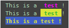

[TOC]

#显示颜色的格式

` \ 033 [显示方式;字体色;背景色m ...... [\ 033 [0m] `

#显示颜色的参数

| 显示方式 |     效果     | 字体色 | 背景色 | 颜色描述 |
| -------- | :----------: | ------ | ------ | -------- |
| 0        | 终端默认设置 | 30     | 40     | 黑色     |
| 1        |   高亮显示   | 31     | 41     | 红色     |
| 4        |  使用下划线  | 32     | 42     | 绿色     |
| 5        |     闪烁     | 33     | 43     | 黄色     |
| 7        |   反白显示   | 34     | 44     | 蓝色     |
| 8        |    不可见    | 35     | 45     | 紫红色   |
|          |              |        | 36     | 46       |
|          |              |        | 37     | 47       |

#实例：

```
print('This is a \033[1;35m test \033[0m!')
print('This is a \033[1;32;43m test \033[0m!')
print('\033[1;33;44mThis is a test !\033[0m')
```
显示：
